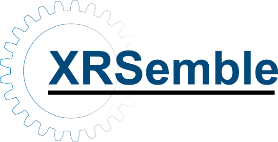
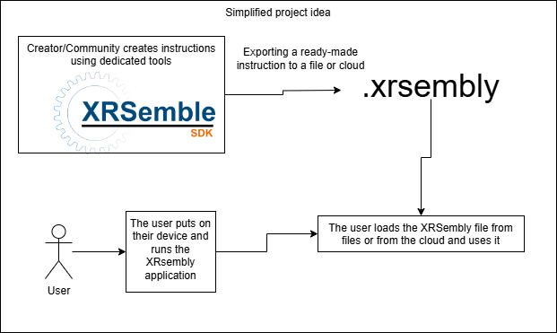

<!-- PROJECT LOGO -->
 

  

  <h3 align="center">Interactive instructions in Mixed Reality</h3>

  

    Create, and share interactive instructions that can be view on XR devices
     
    <a href="https://kamil-roszak.github.io/XRsemble/manual/getting_started.html"><strong>Explore the docs »</strong></a>
     
     
    <a href="https://github.com/Kamil-Roszak/XRsemble">View Demo</a>
    ·
    <a href="https://github.com/Kamil-Roszak/XRsemble/issues/new?labels=bug&template=bug-report---.md">Report Bug</a>
    ·
    <a href="https://github.com/Kamil-Roszak/XRsemble/issues/new?labels=enhancement&template=feature-request---.md">Request Feature</a>
  

<!-- ABOUT THE PROJECT -->
## About The Project

Nowadays, more and more XR devices are emerging, and the market is shifting toward devices priced reasonably for everyday consumers.

Even your average Joe might have a Quest 3S or similar device at home, capable of displaying fully immersive Mixed-Reality experiences. Since we have access to such technology, why not use it to make everyday life easier?

Servicing devices, replacing worn-out parts, assembling furniture—all of it could be simplified when the user sees a real representation of the process in full 3D!

**XRsemble** is an app for XR devices that provides immersive, step-by-step service / assembly instructions in full 3D. Users can create and customize their own instructions, making assembly simple and interactive with the ability to view parts from any angle.

<!-- ROADMAP -->
## Roadmap

- [x] Project creation and description of the basic idea  
- [x] Basic visualization tools available in the editor and working at runtime  
- [ ] Building a demo application for HoloLens 2 and Meta Quest  
- [ ] Exporting and loading .xrsemble files  
- [ ] Adding documentation  
- [ ] Creating demo instructions for a few open-hardware projects

See the [open issues](https://github.com/Kamil-Roszak/XRsemble/issues) for a full list of proposed features (and known issues).

## Compatibility

The project is based on OpenXR, so support for more devices is planned in the future.

| VR Headset           | Support        |
| :-------------------: | :------------: |
| Quest 2/3/3S/Pro     | :heavy_check_mark: |
| HoloLens 2           | :heavy_check_mark: |
| Pico Neo 3/4/4 Ultra | Planned        |
| Vive Focus 3/XR Elite| Planned        |
| Apple Vision Pro     | Planned        |

## External resources

This project uses the following libraries:

- [MRTK (Mixed Reality Toolkit)](https://github.com/microsoft/MixedRealityToolkit-Unity): Used for developing cross-platform Mixed Reality applications in Unity.
- [glTFast](https://github.com/atteneder/glTFast): Used for efficient loading and display of glTF 3D models.
- [KtxUnity](https://github.com/atteneder/KtxUnity): Unity package that allows users to load KTX 2.0 or Basis Universal texture files. 
